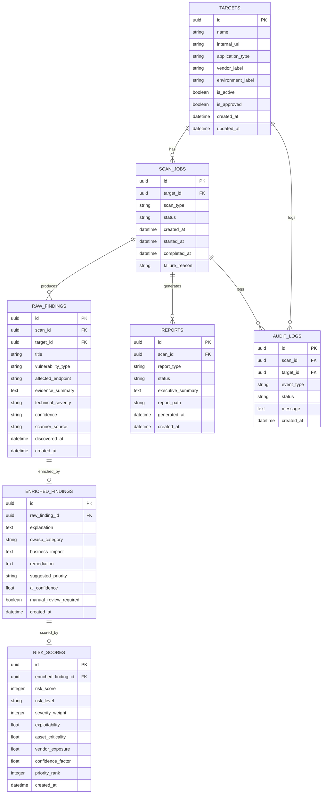

# Arx AI — Database Model / ERD

## 1. Database Model Overview

The database for Arx AI stores all persistent system data needed for scan management, vulnerability findings, AI enrichment, business risk scoring, dashboard metrics, reporting, and audit logging.

Arx AI uses PostgreSQL as the main relational database because the platform has many connected entities. For example, a sandbox target can have many scans, each scan can produce many raw findings, each raw finding can have AI-enriched analysis, and each enriched finding can have a calculated business risk score.

The database is designed around the main MVP workflow:

```text
Approved sandbox target
→ scan job
→ raw findings
→ AI enrichment
→ risk scoring
→ KRI dashboard
→ report generation
```

The MVP database should stay focused on the core workflow. More advanced entities such as users, roles, vendor risk history, notifications, and remediation workflows can be added later as stretch features.

---

## 2. MVP Database Entities

The MVP database should include the following core tables:

1. `targets`
2. `scan_jobs`
3. `raw_findings`
4. `enriched_findings`
5. `risk_scores`
6. `reports`
7. `audit_logs`

These tables are enough to support the first full working version of Arx AI.

---

## 3. Entity Relationship Summary

The main relationships are:

```text
One target can have many scan jobs.

One scan job can have many raw findings.

One raw finding can have one enriched finding.

One enriched finding can have one risk score.

One scan job can have many reports.

One scan job can have many audit log entries.

One target can have many audit log entries.
```

In simplified form:

```text
targets
   ↓
scan_jobs
   ↓
raw_findings
   ↓
enriched_findings
   ↓
risk_scores

scan_jobs
   ↓
reports

scan_jobs / targets
   ↓
audit_logs
```

---

## 4. ERD Diagram



---

## 5. Table Definitions

## 5.1 `targets`

The `targets` table stores approved sandbox applications that Arx AI is allowed to scan.

This table is important because Arx AI should not allow arbitrary public URL scanning. Users select from approved targets instead of entering any URL.

### Purpose

Stores sandbox targets such as:

```text
OWASP Juice Shop
DVWA
Custom vulnerable lab application
```

### Columns

| Column              | Type     | Description                                 |
| ------------------- | -------- | ------------------------------------------- |
| `id`                | UUID     | Primary key                                 |
| `name`              | String   | Human-readable target name                  |
| `internal_url`      | String   | Internal Docker/local URL used by scanner   |
| `application_type`  | String   | Type of application, such as web app or API |
| `vendor_label`      | String   | Demo vendor or business label               |
| `environment_label` | String   | Environment such as local, lab, sandbox     |
| `is_active`         | Boolean  | Whether the target is currently available   |
| `is_approved`       | Boolean  | Whether the target is approved for scanning |
| `created_at`        | DateTime | Record creation time                        |
| `updated_at`        | DateTime | Last update time                            |

### Example Record

```json
{
  "id": "target_001",
  "name": "OWASP Juice Shop",
  "internal_url": "http://juice-shop:3000",
  "application_type": "Web Application",
  "vendor_label": "Vendor A",
  "environment_label": "Sandbox",
  "is_active": true,
  "is_approved": true
}
```

### Design Justification

The `targets` table enforces the ethical boundary of the project. Instead of letting users scan any website, the backend only allows scans against targets already stored and approved in this table.

---

## 5.2 `scan_jobs`

The `scan_jobs` table stores scan requests and their execution status.

### Purpose

Tracks every scan started by the user.

### Columns

| Column           | Type        | Description                    |
| ---------------- | ----------- | ------------------------------ |
| `id`             | UUID        | Primary key                    |
| `target_id`      | UUID        | Foreign key to `targets.id`    |
| `scan_type`      | String      | Type of scan, such as baseline |
| `status`         | String      | Current scan status            |
| `created_at`     | DateTime    | When scan was created          |
| `started_at`     | DateTime    | When scan started              |
| `completed_at`   | DateTime    | When scan completed            |
| `failure_reason` | String/Text | Error message if scan failed   |

### Possible Status Values

```text
queued
running
enriching
scoring
completed
failed
```

### Example Record

```json
{
  "id": "scan_123",
  "target_id": "target_001",
  "scan_type": "baseline",
  "status": "completed",
  "created_at": "2026-07-09T10:30:00",
  "started_at": "2026-07-09T10:31:00",
  "completed_at": "2026-07-09T10:36:00",
  "failure_reason": null
}
```

### Design Justification

This table turns scanning into a managed workflow instead of a one-off script. It allows the system to show scan history, scan status, scan details, and failure information.

---

## 5.3 `raw_findings`

The `raw_findings` table stores normalized scanner output.

### Purpose

Stores original vulnerability findings before AI interpretation.

### Columns

| Column               | Type     | Description                         |
| -------------------- | -------- | ----------------------------------- |
| `id`                 | UUID     | Primary key                         |
| `scan_id`            | UUID     | Foreign key to `scan_jobs.id`       |
| `target_id`          | UUID     | Foreign key to `targets.id`         |
| `title`              | String   | Scanner-provided finding title      |
| `vulnerability_type` | String   | General vulnerability type          |
| `affected_endpoint`  | String   | Affected route or endpoint          |
| `evidence_summary`   | Text     | Short evidence summary from scanner |
| `technical_severity` | String   | Scanner severity                    |
| `confidence`         | String   | Scanner confidence level            |
| `scanner_source`     | String   | Tool that produced the finding      |
| `discovered_at`      | DateTime | When finding was discovered         |
| `created_at`         | DateTime | When finding was stored             |

### Example Record

```json
{
  "id": "finding_456",
  "scan_id": "scan_123",
  "target_id": "target_001",
  "title": "Missing Anti-clickjacking Header",
  "vulnerability_type": "Security Misconfiguration",
  "affected_endpoint": "/login",
  "evidence_summary": "The response did not include a frame protection header.",
  "technical_severity": "Medium",
  "confidence": "High",
  "scanner_source": "OWASP ZAP Baseline",
  "discovered_at": "2026-07-09T10:35:00"
}
```

### Design Justification

Raw findings must be stored before AI enrichment. This preserves the original scanner evidence and prevents AI failure from causing data loss.

---

## 5.4 `enriched_findings`

The `enriched_findings` table stores AI-generated analysis for each raw finding.

### Purpose

Stores AI explanations, OWASP mapping, business impact, and remediation guidance.

### Columns

| Column                   | Type     | Description                      |
| ------------------------ | -------- | -------------------------------- |
| `id`                     | UUID     | Primary key                      |
| `raw_finding_id`         | UUID     | Foreign key to `raw_findings.id` |
| `explanation`            | Text     | Plain-English AI explanation     |
| `owasp_category`         | String   | OWASP category mapping           |
| `business_impact`        | Text     | Business-level impact            |
| `remediation`            | Text     | Suggested remediation            |
| `suggested_priority`     | String   | AI-suggested priority            |
| `ai_confidence`          | Float    | AI confidence score              |
| `manual_review_required` | Boolean  | Whether human review is required |
| `created_at`             | DateTime | When enrichment was created      |

### Example Record

```json
{
  "id": "enriched_789",
  "raw_finding_id": "finding_456",
  "explanation": "This finding indicates that the application may be missing a browser protection header that helps reduce clickjacking risk.",
  "owasp_category": "A05: Security Misconfiguration",
  "business_impact": "An attacker may be able to trick users into interacting with the application in unintended ways.",
  "remediation": "Add appropriate frame protection headers and verify the configuration across sensitive pages.",
  "suggested_priority": "Medium",
  "ai_confidence": 0.86,
  "manual_review_required": false
}
```

### Design Justification

This table separates AI interpretation from raw scanner evidence. That separation is important because AI output is useful but should not overwrite or replace the original finding.

---

## 5.5 `risk_scores`

The `risk_scores` table stores calculated business risk scores for enriched findings.

### Purpose

Converts technical findings into measurable business risk.

### Columns

| Column                | Type     | Description                           |
| --------------------- | -------- | ------------------------------------- |
| `id`                  | UUID     | Primary key                           |
| `enriched_finding_id` | UUID     | Foreign key to `enriched_findings.id` |
| `risk_score`          | Integer  | Final normalized score from 0–100     |
| `risk_level`          | String   | Low, Medium, High, Critical           |
| `severity_weight`     | Integer  | Numeric severity weight               |
| `exploitability`      | Float    | Exploitability factor                 |
| `asset_criticality`   | Float    | Importance of affected target         |
| `vendor_exposure`     | Float    | Vendor or third-party exposure factor |
| `confidence_factor`   | Float    | Confidence adjustment                 |
| `priority_rank`       | Integer  | Ranking among findings                |
| `created_at`          | DateTime | When risk score was calculated        |

### Example Record

```json
{
  "id": "risk_001",
  "enriched_finding_id": "enriched_789",
  "risk_score": 72,
  "risk_level": "High",
  "severity_weight": 7,
  "exploitability": 1.2,
  "asset_criticality": 1.3,
  "vendor_exposure": 1.1,
  "confidence_factor": 0.9,
  "priority_rank": 1
}
```

### Design Justification

Risk scoring should be separate from AI enrichment. The AI can help explain the finding, but the final risk score should come from a documented formula that can be tested and explained.

---

## 5.6 `reports`

The `reports` table stores metadata about generated reports.

### Purpose

Tracks reports generated for scans.

### Columns

| Column              | Type     | Description                     |
| ------------------- | -------- | ------------------------------- |
| `id`                | UUID     | Primary key                     |
| `scan_id`           | UUID     | Foreign key to `scan_jobs.id`   |
| `report_type`       | String   | Type of report                  |
| `status`            | String   | Generated, failed, pending      |
| `executive_summary` | Text     | Summary text                    |
| `report_path`       | String   | Optional path or URL for report |
| `generated_at`      | DateTime | When report was generated       |
| `created_at`        | DateTime | When report record was created  |

### Possible Report Types

```text
scan_summary
executive_summary
vendor_risk
monthly_kri
```

For the MVP, use:

```text
scan_summary
```

### Example Record

```json
{
  "id": "report_001",
  "scan_id": "scan_123",
  "report_type": "scan_summary",
  "status": "generated",
  "executive_summary": "The scan identified several medium and high-risk findings. The highest-priority issue is related to security misconfiguration.",
  "report_path": null,
  "generated_at": "2026-07-09T10:45:00"
}
```

### Design Justification

Reports should be tracked separately so the system can later support PDF exports, report history, and different report types.

---

## 5.7 `audit_logs`

The `audit_logs` table stores important system events.

### Purpose

Provides traceability for scan creation, scan execution, AI enrichment, scoring, and report generation.

### Columns

| Column       | Type     | Description                            |
| ------------ | -------- | -------------------------------------- |
| `id`         | UUID     | Primary key                            |
| `scan_id`    | UUID     | Optional foreign key to `scan_jobs.id` |
| `target_id`  | UUID     | Optional foreign key to `targets.id`   |
| `event_type` | String   | Type of event                          |
| `status`     | String   | Success, failed, info                  |
| `message`    | Text     | Human-readable event message           |
| `created_at` | DateTime | When event occurred                    |

### Example Event Types

```text
scan_created
scan_started
scan_completed
scan_failed
raw_findings_stored
ai_enrichment_started
ai_enrichment_completed
ai_enrichment_failed
risk_scoring_completed
report_generated
report_failed
```

### Example Record

```json
{
  "id": "log_001",
  "scan_id": "scan_123",
  "target_id": "target_001",
  "event_type": "scan_completed",
  "status": "success",
  "message": "Scan completed and findings were stored successfully.",
  "created_at": "2026-07-09T10:36:00"
}
```

### Design Justification

Audit logs are important for a security-related system because they help explain what happened and when. They also support debugging and professional traceability.

---

## 6. MVP Relationship Details

## 6.1 `targets` to `scan_jobs`

Relationship:

```text
One target can have many scan jobs.
```

Reason:

The same sandbox application may be scanned multiple times.

Example:

```text
OWASP Juice Shop
→ Scan 1
→ Scan 2
→ Scan 3
```

Database relationship:

```text
targets.id → scan_jobs.target_id
```

---

## 6.2 `scan_jobs` to `raw_findings`

Relationship:

```text
One scan job can produce many raw findings.
```

Reason:

A single scan can discover multiple issues.

Database relationship:

```text
scan_jobs.id → raw_findings.scan_id
```

---

## 6.3 `raw_findings` to `enriched_findings`

Relationship:

```text
One raw finding can have one enriched finding.
```

Reason:

Each scanner finding should receive one AI-generated analysis.

Database relationship:

```text
raw_findings.id → enriched_findings.raw_finding_id
```

This should usually be a one-to-one relationship.

---

## 6.4 `enriched_findings` to `risk_scores`

Relationship:

```text
One enriched finding can have one risk score.
```

Reason:

Each enriched finding should receive one calculated business risk score.

Database relationship:

```text
enriched_findings.id → risk_scores.enriched_finding_id
```

This should usually be a one-to-one relationship.

---

## 6.5 `scan_jobs` to `reports`

Relationship:

```text
One scan job can have many reports.
```

Reason:

A scan may generate multiple report types in the future, such as scan summary, executive summary, or vendor risk report.

Database relationship:

```text
scan_jobs.id → reports.scan_id
```

For the MVP, one scan summary report is enough.

---

## 6.6 `scan_jobs` and `targets` to `audit_logs`

Relationship:

```text
A scan job can have many audit logs.
A target can have many audit logs.
```

Reason:

Important events should be traceable.

Database relationships:

```text
scan_jobs.id → audit_logs.scan_id
targets.id → audit_logs.target_id
```

---

## 7. Stretch Database Entities

The following tables are not required for the MVP but can be added later.

## 7.1 `users`

Used if authentication is added.

Possible columns:

```text
id
name
email
password_hash
created_at
updated_at
```

---

## 7.2 `roles`

Used for role-based access control.

Possible roles:

```text
Security Analyst
Security Manager
Developer
Admin
```

Possible columns:

```text
id
name
description
created_at
```

---

## 7.3 `user_roles`

Used to connect users to roles.

Possible columns:

```text
id
user_id
role_id
created_at
```

---

## 7.4 `vendors`

Used for advanced vendor risk scoring.

Possible columns:

```text
id
name
criticality
exposure_level
contact_owner
created_at
updated_at
```

For the MVP, `vendor_label` can stay inside the `targets` table. A full `vendors` table can be added later.

---

## 7.5 `assets`

Used to model applications, systems, or business assets.

Possible columns:

```text
id
target_id
vendor_id
name
asset_type
business_unit
criticality
created_at
updated_at
```

---

## 7.6 `kri_snapshots`

Used to store historical KRI summaries.

Possible columns:

```text
id
snapshot_date
total_scans
total_findings
critical_findings
high_findings
average_risk_score
highest_risk_target_id
highest_risk_vendor_id
top_owasp_category
created_at
```

For the MVP, KRI metrics can be calculated directly from database queries instead of stored as snapshots.

---

## 7.7 `notifications`

Used for future in-app or email notifications.

Possible columns:

```text
id
event_type
title
message
is_read
created_at
```

---

## 7.8 `remediation_notes`

Used for future developer remediation workflow.

Possible columns:

```text
id
finding_id
note
status
created_at
updated_at
```

---

## 8. MVP Database Design Principles

The database design follows these principles:

### 8.1 Preserve Raw Evidence

Raw scanner findings are stored before AI enrichment. This ensures that original evidence is never lost.

### 8.2 Separate Evidence From Interpretation

Raw findings and AI-enriched findings are stored in separate tables. This keeps scanner output separate from AI-generated analysis.

### 8.3 Keep Risk Scoring Explainable

Risk scores are stored separately and include the factors used in the calculation. This makes the final risk score easier to justify.

### 8.4 Support Historical Analysis

Scan jobs and findings are stored permanently so Arx AI can support trend analysis and KRI dashboards.

### 8.5 Support Future Extensions

The MVP schema is simple, but it can grow to include users, roles, vendors, assets, KRI snapshots, notifications, and remediation tracking.

### 8.6 Enforce Ethical Boundaries

The `targets` table controls what can be scanned. This prevents arbitrary public URL scanning and keeps Arx AI limited to approved sandbox targets.

---

## 9. Recommended MVP Build Order for the Database

The database should be built in this order:

```text
1. targets
2. scan_jobs
3. raw_findings
4. enriched_findings
5. risk_scores
6. reports
7. audit_logs
```

This order matches the main system workflow.

Start with:

```text
targets
scan_jobs
```

Then add:

```text
raw_findings
```

Then add:

```text
enriched_findings
risk_scores
```

Finally add:

```text
reports
audit_logs
```

This prevents the database from becoming too complex before the core scan workflow works.

---

## 10. MVP ERD Summary

The MVP database model for Arx AI is:

```text
targets
- stores approved sandbox applications

scan_jobs
- stores scan requests and scan status

raw_findings
- stores original scanner findings

enriched_findings
- stores AI-generated explanations and classifications

risk_scores
- stores calculated business risk scores

reports
- stores report metadata and summaries

audit_logs
- stores important system events
```

This schema supports the complete MVP workflow while leaving room for advanced future features.
